# Pi-tMaster Quick Start Guide

## Installation

1. Run: `git clone https://github.com/gigoiy/Pi-tMaster.git`
2. Open terminal in the Pi-tMaster directory
3. Run: `chmod +x install.sh && ./install.sh`

## Uninstallation

1. Open terminal in the Pi-tMaster directory
2. Run: `chmod +x uninstall.sh && ./uninstall.sh`

## Sensor Wiring

Connect all three MAX6675 boards as follows:

### Shared Connections (all boards):

- **SO** → GPIO9 (pin 21) - MISO
- **SCLK** → GPIO11 (pin 23) - SCLK  
- **VCC** → 5V
- **GND** → GND

### Individual Chip Select:

- **Left Smoker** CS → GPIO8 (pin 24)
- **Right Smoker** CS → GPIO7 (pin 26)
- **Meat Probe** CS → GPIO16 (pin 36)

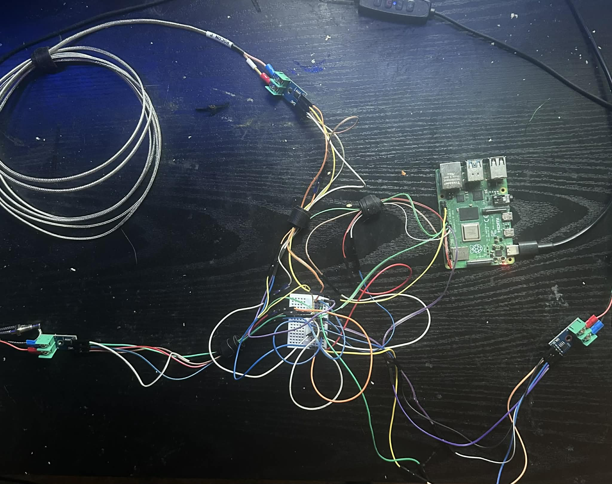
(Enclosure, Solar Power, and Perfboard Coming Soon)

## Program Architecture
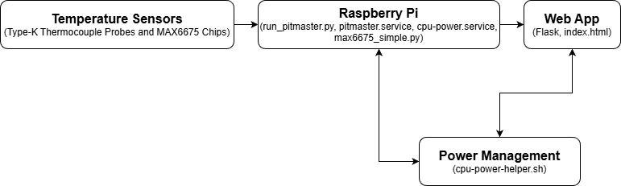

## Performance Notes

**Hardware Used**

- **Computer:** Raspberry Pi 4B
- **Thermocouples:** 2x Generic K Type Probes, 1x Sharp-Pointed Stainless Steel K Type Probe
- **Modules:** 3x MAX6675 Breakout Modules

### Route Stress Testing  

|**Route**       |**Max Requests/Second**|**Max Request Latency (Seconds)**|**Max CPU Usage**|
|:---------------|:---------------------:|:-------------------------------:|:---------------:|
|**/**           |61.03                  |16.712103                        |118.5 %          |
|**/temperature**|60.21                  |16.941499                        |117.8 %          |
|**/data**       |60.73                  |16.796365                        |117.5 %          |  

## Accessing the Web Interface

After installation, open a web browser and go to:
- `http://[your-pi-ip]:8080`
- or `http://pitmaster.local:8080`


## GUI Breakdown

**There are four tabs in the web app:**

- Temperature
- Calibration
- Power
- Test

### Temperature

- **Real-time Temperature:** Displays the real-time temperature of three different temperature probes
- **Sensor Status:** Displays the functionality status of the temperature sensors and the response time

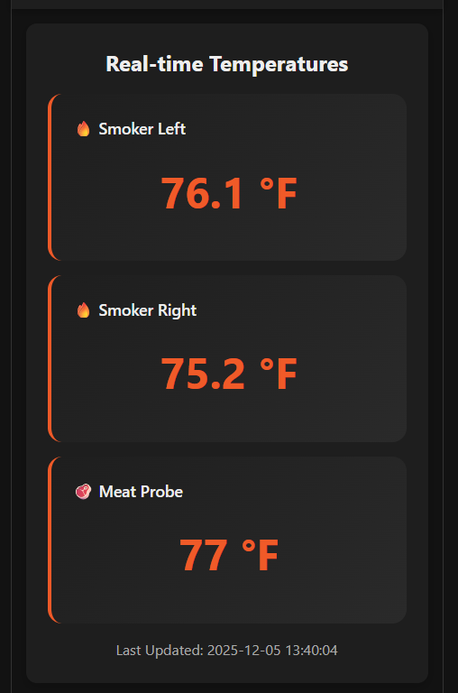

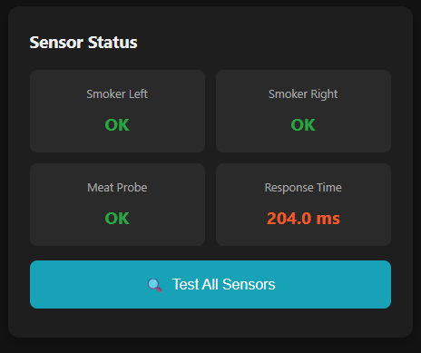

### Calibration

- **3-Point Calibration:** Select the sensor to do a 3-point calibration, perform the calibration.
- **Calibration Guide:** Vaguely guides you through the process of doing each point in the 3-point calibration

**Notes on Calibration:**

- The current calibration procedure hasn't been tested thoroughly but complete testing will be done
- There will be an at-home calibration manual developed once the procedure has been completely tested
- There will also be a professional calibration manual developed for professional metrology laboratories

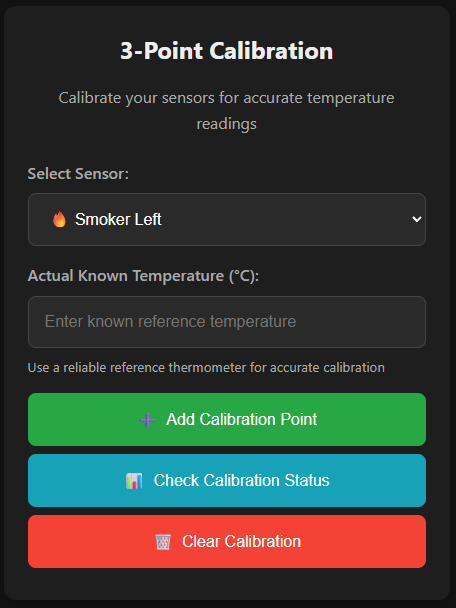

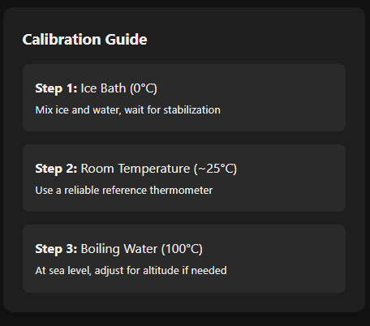

### Power

- **System Power Controls:** Enable low power and full power modes as well as check the power status of the system
- **System Operations:** Reboot the system and shutdown the system completely
- **Power Modes Explained:** Explains each power mode thoroughly

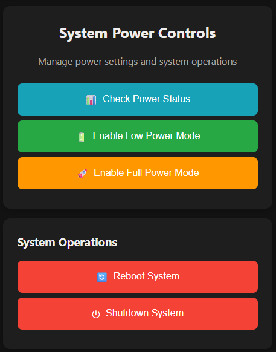

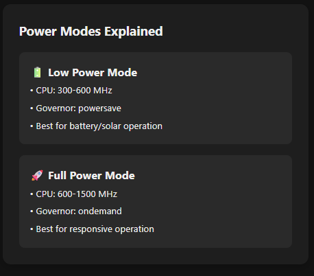


### Test

- **Testing Mode Status:** Displays whether testing mode is active or not, testing mode will disable real-time sensor functionality
- **Simulation Mode Control:** Toggles the simulation mode on/off
- **Set Individual Sensor Temperature:** Sends a simulated temperature to an individual sensor
- **Set All Sensors Temperature:** Sends a simulated temperature to all sensors at once
- **Quick Test Presets:** Presets of commonly used temperatures to simulate to the sensors
- **Extreme Value Testing:** Tests the JSON response integrity with extreme values
- **Current Simulation Status:** Get the current simulated temperatures from the sensors
- **Testing Notes:** Additional notes on using the Test mode

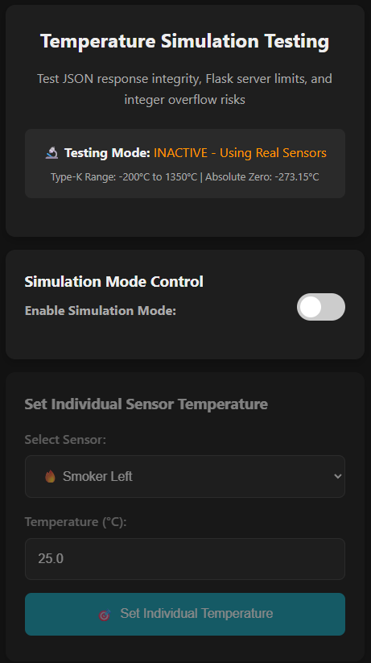

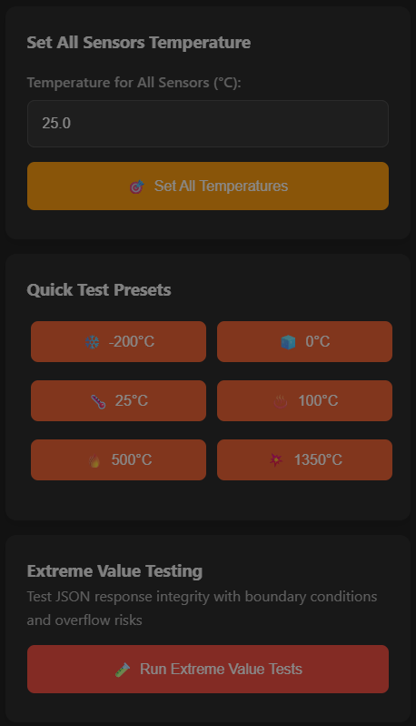

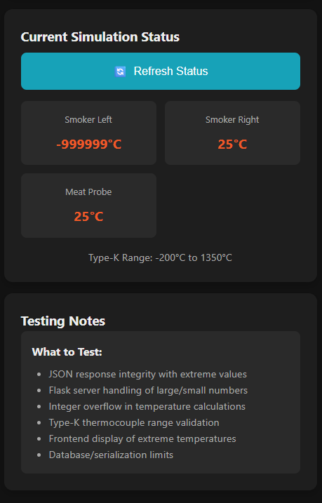

## Management Commands

```bash
# Stop/Start service
sudo systemctl stop pitmaster.service
sudo systemctl start pitmaster.service

# View logs
sudo journalctl -u pitmaster.service -f

# Check status
sudo systemctl status pitmaster.service