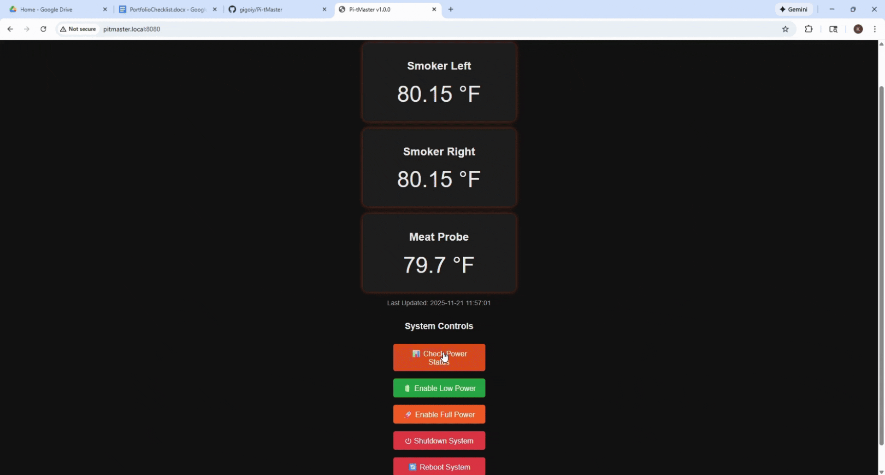

# Pi-tMaster Quick Start Guide

## Installation

1. Run: `git clone https://github.com/gigoiy/Pi-tMaster.git`
2. Open terminal in the Pi-tMaster directory
3. Run: `chmod +x install.sh && ./install.sh`

## Uninstallation

1. Open terminal in the Pi-tMaster directory
2. Run: `chmod +x uninstall.sh && ./uninstall.sh`

## Sensor Wiring

Connect all three MAX6675 boards as follows:

### Shared Connections (all boards):

- **SO** → GPIO9 (pin 21) - MISO
- **SCLK** → GPIO11 (pin 23) - SCLK  
- **VCC** → 5V
- **GND** → GND

### Individual Chip Select:

- **Left Smoker** CS → GPIO8 (pin 24)
- **Right Smoker** CS → GPIO7 (pin 26)
- **Meat Probe** CS → GPIO16 (pin 36)


(Enclosure, Solar Power, and Perfboard Coming Soon)

## Program Architecture


## Accessing the Web Interface

After installation, open a web browser and go to:
- `http://[your-pi-ip]:8080`
- or `http://pitmaster.local:8080`





## Management Commands

```bash
# Stop/Start service
sudo systemctl stop pitmaster.service
sudo systemctl start pitmaster.service

# View logs
sudo journalctl -u pitmaster.service -f

# Check status
sudo systemctl status pitmaster.service